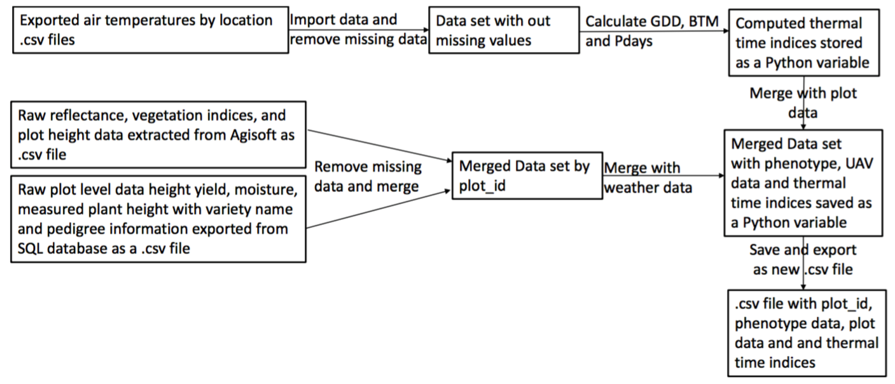
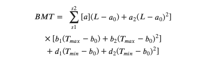

## Calculating thermal time indices and merging UAV data.

**Name**: Byron Evers 
**Semester**: Spring 2019  
**Project area**: Agronomy

## Objective
Write a python function to calculate biometeorological time (BMT), physiological days (Pdays) and growing degree days (GDD) for several UAV collection dates. The objective is to have the thermal time parameters calculated for the specific dates that UAV data was collected. 
Ultimitly, through a python function, I would like merge all of the UAV reflectance data, plot level phenotypic data and the calculated thermal values into one .csv file. 

## Outcomes
The final outcome is to generate a .csv file that has UAV and plot level phenotype data merged by plot_id with additional columns for calculated date times. 

## Rationale

Current phenotyping methods are labor intensive, hard to replicate, and have limited temporal resolution. UAVs equipped with multispectral sensors present a possible solution to obtain valuable time sensitive data. To use these data points in spatio-temporal models, crop phenology needs to be estimate. Past research papers have used a range of thermal time equations to estimate crop phenology (Saiyed et al 2009). However, there is still a need to compare evaluate these thermal predictors in relationship to reflectance data.

Over the last two growing season I have collected UAV reflectance data across several breeding nursery locations at several dates. Currently this data is being merged with plot level data with excel. This process is inefficient and introduces potential errors. I would like to stream line this process with Python. Additionally, having the ability to calculate several phenological development thermal times, with a Python function, will be useful for modeling purposes.

Current UAV pipeline includes stitching photos and extracting plot level reflectance data through Agisoft software. Data recived from this process is formated as a .csv file and includes 5 indiviual reflectance bands (R,G,B,RE and NIR) and 3 vegitative indices (NDVI, NDRE and GNDVI). Each band and vegitative index can be be used to analyze biophysical traits of various crops. At this time I do not wish to calculate these indcies with python, though I would like to write a python script that can combine the Agisoft data with the calculated thermal times and plot level data such as yield and plant hieght. 

## Sketch

## Thermal Time Indices 

* **BMT**-Biometeorological Time
* **GDD**-Growing Degree Days
* **Pdays**-Physiological Days 

## Thermal Time Variables
* **Tmax**-Maximum Air Temperature in a Day
* **Tminx**-Minimum Air Temperature in a Day
* **Tbase**-Base Air Temperature(5oC)
* **Topt**-Optimum Air Temperature(5oC)
* **L**-Daily Photoperiod
* **T**-Daily Temperature
* **a0**-Base Daylength
* **b0**-Base Temperature

## Thermal Time Equations 

## Reflectance Indices and Variables

* **NDVI**- Normalized Difference Vegitation Index 
* **NDRE**- Normalized Difference Red Edge
* **GNDVI**- Green Normalized Difference Vegitation Index

## Reflectance Variables

* **NIR**- Near-infared reflectance between 800-880nm 
* **RE**- Red Edge reflectance between 707-727nm 
* **R**- Red reflectance between 658-678nm 
* **G**- Green reflectance between 540-560nm 
* **B**- Blue reflectance between 455-495nm 

## Reflectance Equations 

## References
Kyratzis Angelos C., Skarlatos Dimitrios P., Menexes George C., Vamvakousis Vasileios F., Katsiotis Andreas, 2017. Assessment of Vegetation Indices Derived by UAV Imagery for Durum Wheat Phenotyping under a Water Limited and Heat Stressed Mediterranean Environment. Frontiers in Plant Science V.8 P 1114

Saiyed, I., Bullock, P.R., Sapirstein, H.D., Finlay, G.J., Jarvis, C.K., 2009. Thermal time models for estimating wheat phenological development and weather-based relationships to wheat quality. Can. J. Plant Sci. 89, 429–439.

%5Cbegin%7Bequation%2A%7D%0D%0A%5C+BMT%3D%0D%0A%5C+%5Csum_%7Bs1%7D%5E%7Bs2%7D+%7B%5Ba%5D%28L-a_0%29%2Ba_2%28L-a_0%29%5E2%7D%5D%5C%5C%0D%0A%5C+%5Ctimes%5Bb_1%28T_%7Bmax%7D-b_0%29%2Bb_2%28T_%7Bmax%7D-b_0%29%5E2%5D%5C%5C%0D%0A%5C+%2Bd_1%28T_%7Bmin%7D-b_0%29%2Bd_2%28T_%7Bmin%7D-b_0%29%5E2%5D%0D%0A%5Cend%7Bequation%2A%7D
